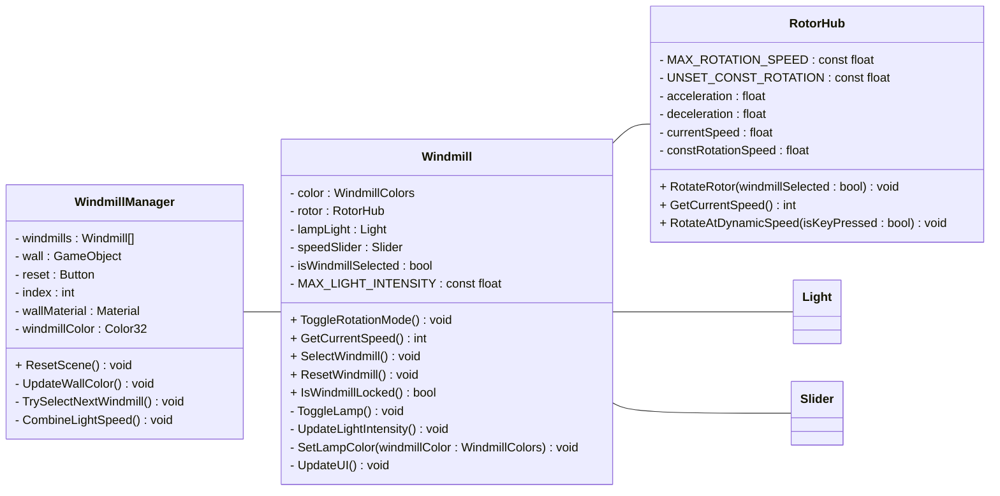

# 🎯 Lernziele: Windräder-Projekt in Unity

Die Windmills in diesem Projekt sind interaktive Objekte, die sich drehen und durch eine Benutzerinteraktion gesteuert werden können. Jedes Windrad besteht aus mehreren Komponenten:

+ Ein RotorHub, der für die Rotation und Beschleunigung zuständig ist.
+ Eine Lampe, deren Helligkeit basierend auf der Geschwindigkeit angepasst wird.
+ Ein UI-Slider, um die aktuelle Geschwindigkeit visuell darzustellen.
  
Jedes Windrd kann individuell gesteuert und gesperrt werden.
Die Verwaltung erfolgt über den WindmillManager, der das aktive Windrad auswählt und die Leinwandfarbe entsprechend der Windgeschwindigkeit aktualisiert.

https://github.com/user-attachments/assets/802cf4e6-ce6f-4dc4-8473-66f98693ec3a

## 🏗 **Grundlagen von GameObjects und Hierarchie**
- [x] **Whiteboxing mit Primitives**: Erstellen eines einfachen Windrades aus grundlegenden Formen (Cubes, Cylinders).
- [x] **Pivot-Punkt setzen**: Das Windrad als **Kind-Objekt** eines leeren GameObjects anlegen, um die Drehung korrekt zu steuern.

## 🔄 **Transformation & Bewegung in Unity**
- [x] **Rotation mit `transform.Rotate`**: Wie sich ein Objekt um eine Achse dreht.
- [x] **Verstehen von `Time.deltaTime`**: Warum es für flüssige Bewegungen genutzt wird.

## 🎮 **Benutzerinteraktion & Steuerung**
- [x] **Tasteneingabe (`Input.GetKey`)**: 
  - [x] Space-Taste gedrückt halten = Beschleunigung.
  - [x] Space-Taste loslassen = Verlangsamung.
- [x] **Mehrere Windräder unabhängig steuerbar machen**: Nur das aktuell ausgewählte Windrad soll auf `Space` und Buttoninput per Maus ('Lock') reagieren.

## 🖥 **UI-Elemente & Visualisierung von Variablen**
- [x] **Einbindung eines `Slider`-Elements**: Anzeige der aktuellen Geschwindigkeit (0–255).
- [x] **Werteskalierung (`Mathf.Lerp`)**: Geschwindigkeit in eine Lichtintensität umwandeln.

## 🏗 **Mehrere Objekte verwalten & Interaktion zwischen Objekten**
- [x] **Mehrere Windräder in einer Szene**: Jede hat eigene Steuerung, aber dasselbe Skript.
- [x] **Unterschiedliche Zustände pro Windrad**: Eine ist aktiv steuerbar, andere nicht.

## ✏️**Klassendiagramm

